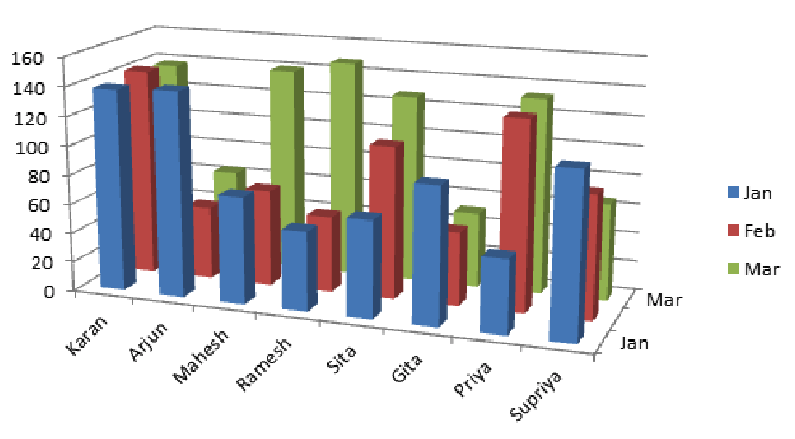
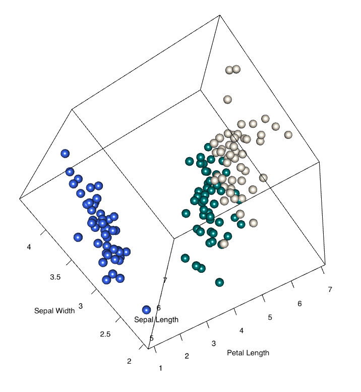

<br><br>
<div class="mycontent">

`Three dimensional` objects are very popular but negatively affect the `accuracy` and `speed` at which one can interpret a graphic in most cases. Here is a review of the main graphic types involving 3d, with a discussion of whether or not they are considered bad practice.


#3D Barplots: Don't
***

Here is a 3d barplot. You are probably familiar with this kind of figure since it is created with Excel, and thus widely used. Compared with a classic grouped barplot, this representation has several drawbacks:

- it is more difficult to find the exact percentages of a bar
- as contructed, for an equivalent value green bars in the back appear smaller than blue bars in the front
- green bars in the back are hidden

<br>

<center>

</center>

<br>

<center>[Source](https://www.quora.com/How-is-a-3D-column-chart-made-in-Excel)</center>


<u>Workaround</u>: Just stick to the normal [barplot](https://www.data-to-viz.com/graph/barplot.html).


# 3D Pie charts: Don't
***
Nothing is worse than a [pie chart](https://www.data-to-viz.com/caveat/pie.html) in dataviz, except a 3D pie chart. Data to viz offers a whole post on [pie chart issues](https://www.data-to-viz.com/caveat/pie.html).  

Adding 3D makes it even worse since it distorts reality. Indeed, the part at the back looks smaller than the one at the front, which is not the case.

<center>

</center>

<center>[source](http://www.e-tabs.com/data-viz-blog/3d-good-hd-bad-dv/)</center>

<u>Workaround</u>: Don't make [pie charts](https://www.data-to-viz.com/caveat/pie.html).


# Static 3D scatterplots: Don't
***
The 3d scatterplot is another common use of 3d in data visualization. This kind of chart takes 3 numeric variables as inputs, and represents them on the X, Y and Z axes.

The accuracy of 3D scatterplots is widely [discussed](https://www.gabrielaplucinska.com/blog/2017/8/7/3d-graphs). For instance, try to determine the X, Y and Z coordinates of a specific point. You will realize that it is quite impossible since the human eye reads 3d poorly. Thus, this graphic lacks accuracy.

<center>

</center>

<u>Workaround</u>: Use a [bubble chart](https://www.data-to-viz.com/graph/bubble.html) instead, or a [scatterplot](https://www.data-to-viz.com/graph/scatter.html) with color gradients.


# Interactive 3D scatterplots: Perhaps
***

In my opinion, the 3d scatterplot can make sense only if you can interact with the chart. On the following, you can use your mouse to change the orientation of the plot and zoom on it. It gives a real feeling of 3D that does not exist otherwise. It is still hard to get the accurate coordinates of points, but allows one to efficiently explore the group structure.

```{r rgl-firstexample, webgl=TRUE, results='hide', warning=FALSE, message=FALSE, fig.width=9, fig.height=9}
# library
library(rgl)

# This is to output a rgl plot in a rmarkdown document. Note that you must add webgl=TRUE, results='hide' in the chunck header
library(knitr)
knit_hooks$set(webgl = hook_webgl)

# Data: the iris data is provided by R
data <- iris

# Add a new column with color
mycolors <- c('royalblue1', 'darkcyan', 'oldlace')
data$color <- mycolors[ as.numeric(data$Species) ]

# Plot
par(mar=c(0,0,0,0))
plot3d( 
  x=data$`Sepal.Length`, y=data$`Sepal.Width`, z=data$`Petal.Length`, 
  col = data$color, 
  type = 's', 
  radius = .1,
  xlab="Sepal Length", ylab="Sepal Width", zlab="Petal Length")
```


#Surface plot: Why not
***
If you have grid coordinates with a numeric variable for each position, you can represent your data using a surface plot. This kind of representation makes sense especially if the numeric value represents an altitude. In this case, we are actually building a 3D element that is a real 3d object, which makes sense in my opinion.

```{r, message=FALSE, warning=FALSE}
# Library
library(plotly)

# Plot
plot_ly(z = volcano, type = "surface")
```


#Going further
***
- 3D: good for HD, bad for DV by [E-tabs](http://www.e-tabs.com/data-viz-blog/3d-good-hd-bad-dv/)
- When 3D works by Andy Kirk on [Visualising data](http://www.visualisingdata.com/2015/03/when-3d-works/).
- 3D graphs by [data in the spotlight](https://www.gabrielaplucinska.com/blog/2017/8/7/3d-graphs)
- Is the Avoidance of 3-D Bar Graphs a Knee-Jerk Reaction? by Stephen Few in [Visual Business Intelligence](https://www.perceptualedge.com/blog/?p=2362)

#Comments
***
Any thoughts on this? Found any mistake? Disagree? Please drop me a word on [twitter](https://twitter.com/R_Graph_Gallery) or in the comment section below:
<br>


</div>


