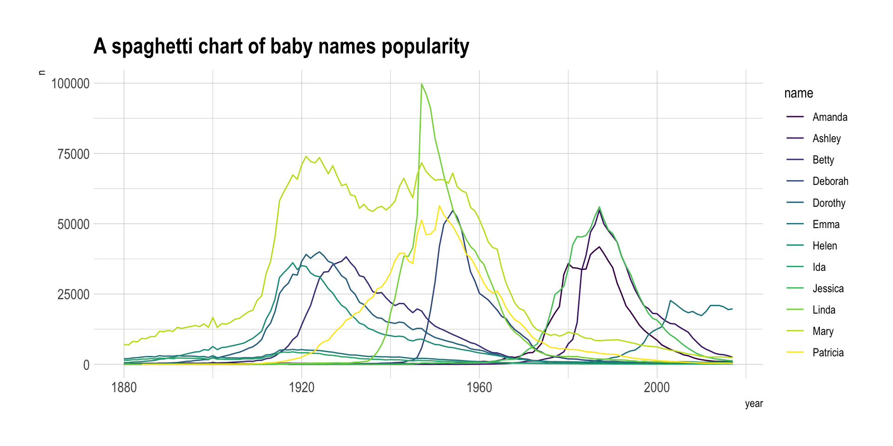
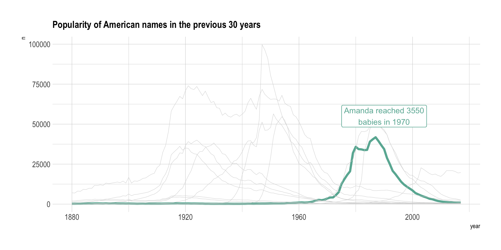
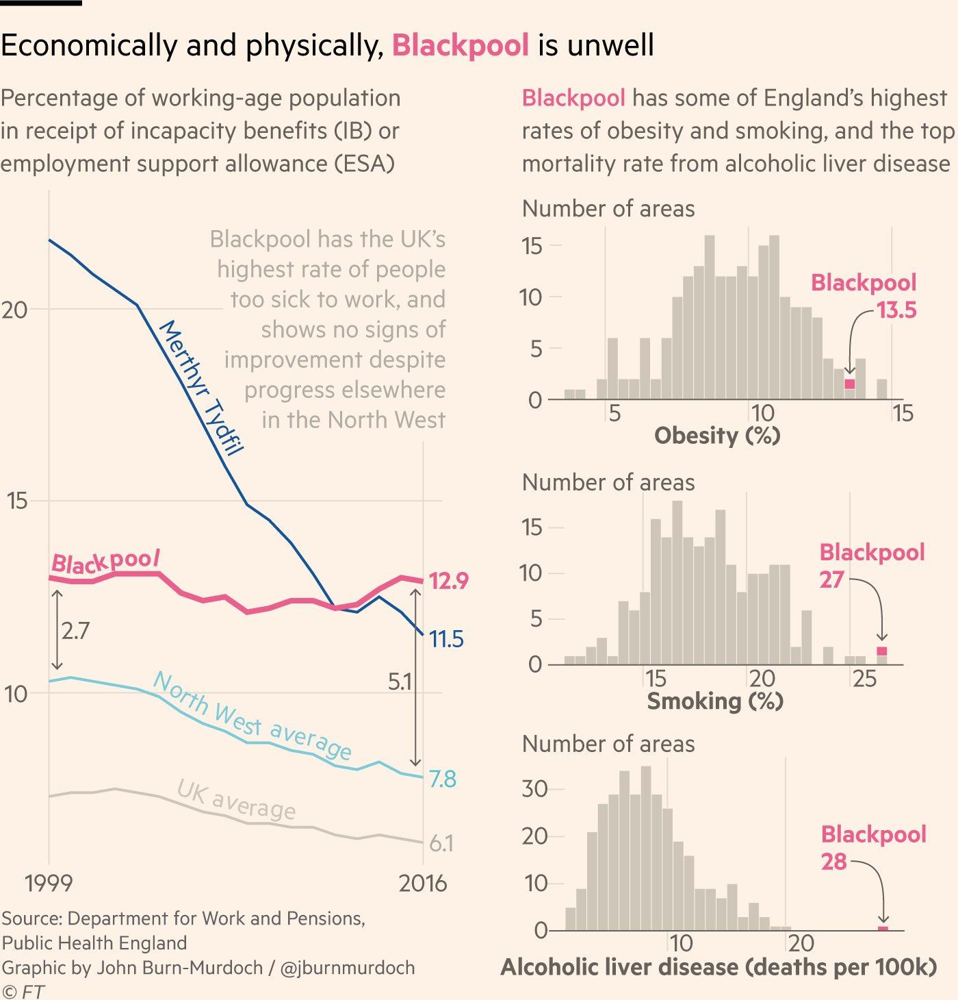

<br><br>
<div class="mycontent">

Annotation is a crucial component of a good dataviz. It can turn a boring graphic into an interesting and insightful way to convey information. Dataviz is often separated in two main types: `exploratory` and `explanatory` analysis. Annotation is used for the second type.

Our current attention span for looking at things online is, on average, less than five seconds. So if you can’t grab someone’s attention within five seconds, you’ve likely lost your viewer. Adding accurate annotation can greatly help to grab audience attention. Use keywords, shapes, colors and other visuals to help them go straight to the point.

Annotation is a general concept, and hundreds of different ways to annotate a chart exist, depending on the `context`. Let's study a few examples.


# Example 1
***

The main danger when plotting a line chart is to end up with a spaghetti chart: having too many groups often results in a confusing figure where it is hard to detect any pattern. This topic is well described here.


``` r
# Libraries
library(tidyverse)
library(hrbrthemes)
library(babynames)
library(viridis)

# Load dataset from github
data <- babynames %>%
  filter(name %in% c("Mary","Emma", "Ida", "Ashley", "Amanda", "Jessica",    "Patricia", "Linda", "Deborah",   "Dorothy", "Betty", "Helen")) %>%
  filter(sex=="F")

# Plot
data %>%
  ggplot( aes(x=year, y=n, group=name, color=name)) +
    geom_line() +
    scale_color_viridis(discrete = TRUE) +
    theme(
      legend.position="none",
      plot.title = element_text(size=14)
    ) +
    ggtitle("A spaghetti chart of baby names popularity") +
    theme_ipsum()
```



Instead of presenting this graphic to your audience, you probably want to highlight your main point. Let's say that you're specifically interested in the evolution of Amanda. Then it makes more sense to build something like this:

``` r
data %>%
  mutate( highlight=ifelse(name=="Amanda", "Amanda", "Other")) %>%
  ggplot( aes(x=year, y=n, group=name, color=highlight, size=highlight)) +
    geom_line() +
    scale_color_manual(values = c("#69b3a2", "lightgrey")) +
    scale_size_manual(values=c(1.5,0.2)) +
    theme(legend.position="none") +
    ggtitle("Popularity of American names in the previous 30 years") +
    theme_ipsum() +
    geom_label( x=1990, y=55000, label="Amanda reached 3550\nbabies in 1970", size=4, color="#69b3a2") +
    theme(
      legend.position="none",
      plot.title = element_text(size=14)
)
```




# Example 2
***

Here is a second example created by [John Burn-Murdoch](https://twitter.com/jburnmurdoch) for the [financial time](https://www.ft.com/content/b6dbf34e-c987-11e7-aa33-c63fdc9b8c6c). I found it on a website that I highly recommand: [Dataviz Done Right](http://www.datavizdoneright.com/2017/12/blackpool.html)

Here you can see that annotation plays a key role:

- the Blackpool line is slightly thicker so that it stands out a bit more
- the histograms are interesting because of the annotation. Note that the color is consistent between graphics.
- the values of the gaps at the start and end of the line are written so that the reader doesn't have to do the math in their head.

<br>

<center>

</center>

<br>

<center>[Source](http://www.datavizdoneright.com/2017/12/blackpool.html)</center>


# Going further
***
- Making Annotations First-Class Citizens in Data Visualization. By Elijah Meeks on [Medium](https://medium.com/@Elijah_Meeks/making-annotations-first-class-citizens-in-data-visualization-21db6383d3fe)
- About the 5 seconds rule on [tableau blog](https://www.tableau.com/about/blog/2016/5/5-tips-effective-visual-data-communication-54174)
- Improving data visualization: Where do I put all those annotations? by [Simon Hiltebeitel](https://www.usaidassist.org/blog/improving-data-visualization-where-do-i-put-all-those-annotations)
- How to Improve Your Data Visualizations with Annotations. By Tim Brock on [Infragistics](https://www.infragistics.com/community/blogs/b/tim_brock/posts/annotate-wisely)


<br>


</div>


