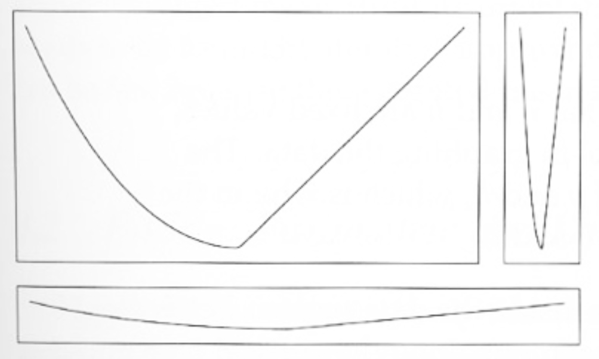

<br><br>
<div class="mycontent">

`Aspect ratio` is defined as the ratio of the width to the height of a graphic. It can have a strong impact on the insights gained from your graphic.  

<br>

Here is an example with a line plot showing yearly sunspot numbers from 1749 to 1983. ([Sunspots](https://en.wikipedia.org/wiki/Sunspot) are temporary phenomena on the Sun's photosphere that appear as spots darker than the surrounding areas.). The dataset comes from this [scientific publication](https://onlinelibrary.wiley.com/doi/abs/10.1002/asna.19622860613) originally, related by [Andrews et al.](https://www.springer.com/gp/book/9781461295631).

```{r, warning=FALSE, message=FALSE, fig.align="center"}
# Libraries
library(tidyverse)
library(hrbrthemes)

# Load dataset: comes with R
data <- data.frame(
  Year = as.numeric(time(sunspot.year)),
  Sunspots = as.numeric(sunspot.year)
)

# Plot
data %>%
  ggplot( aes(x=Year, y=Sunspots)) +
    geom_line() +
    ggtitle("Number of sunspots per year") +
    theme_ipsum() +
    theme(
      plot.title = element_text(size=12)
    )
```


The [solar cycle](https://en.wikipedia.org/wiki/Solar_cycle) is quite obvious on this figure. The sunspot numbers follow this periodic 11-year change in the sun's activity, making the line go up and down quite regularly. It is also clear that some spikes are higher than others, with maximum smoothed sunspot numbers ranging from 50 to 180.


#Playing with the aspect ratio
***
Now let's change the aspect ratio of this figure, making it wider and less high. To exaggerate the effect, the graphic is zoomed to the 1800 to 1900 period:
```{r, warning=FALSE, message=FALSE, fig.align="center", fig.width=12, fig.height=3}

# Plot
data %>%
  filter(Year>1800 & Year<1900) %>%
  ggplot( aes(x=Year, y=Sunspots)) +
    geom_line() +
    ggtitle("Number of sunspots per year") +
    theme_ipsum() +
    theme(
      plot.title = element_text(size=12)
    )
```

The conclusions found using the first graphic are still true, but here a new pattern is visible. The sunspot number increases quicker than it decreases ([ref](http://adsabs.harvard.edu/full/1992SoPh..137...51H)). This is due to the fact that the sunspot decay rate is lower than the formation rate ([ref](http://www2.mps.mpg.de/dokumente/publikationen/solanki/r45.pdf)).

<br>

On the first chart this pattern was not visible since the lines were almost vertical from the bottom to the top of the axis. Here, with the slope being less steep, this pattern becomes visible.


#Target 45 degrees
***

Here is a figure from [W.S. Cleveland](https://www.amazon.com/Visualizing-Data-William-S-Cleveland/dp/0963488406) explaining that the aspect ratio of a graphic should target a 45 degree angle on this kind of figure. It shows what happens when angles are too big or too small:

<br><br>

<center>

</center>

<center>
[W.S. Cleveland. 1993. Visualizing Data.](https://www.amazon.com/Visualizing-Data-William-S-Cleveland/dp/0963488406)
</center>
<br><br>


#Interactivity
***

In this type of situation, producing an interactive graphic allows the user to `zoom` to a specific part and thus to try several different aspect ratio. Allowing this kind of exploration greatly improves the value of your graphic:

```{r, warning=FALSE, message=FALSE, fig.align="center", fig.width=9, fig.height=6}

library(plotly)

# Plot
p <- data %>%
  ggplot( aes(x=Year, y=Sunspots)) +
    geom_line() +
    ggtitle("# of sunspots (select a zone to zoom in)") +
    theme_ipsum() +
    theme(
      plot.title = element_text(size=12)
    )

ggplotly(p)
```


#Going further
***

- About the 45° rule: [W.S. Cleveland. 1993. Visualizing Data.](https://www.amazon.com/Visualizing-Data-William-S-Cleveland/dp/0963488406)
- Making line plots in [R](https://www.r-graph-gallery.com/line-plot/) and [Python](https://python-graph-gallery.com/line-chart/)

#Comments
***
Any thoughts on this? Found any mistake? Disagree? Please drop me a word on [twitter](https://twitter.com/R_Graph_Gallery) or in the comment section below:
<br>


</div>


