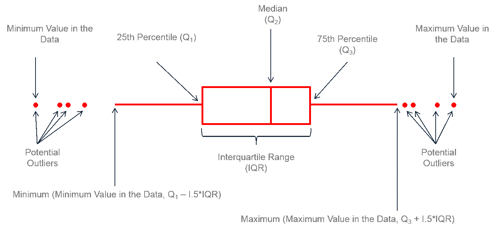

<br><br>
<div class="mycontent">


## Boxplot definition
***

A boxplot provides an effective **summary** of one or more numeric variables, showcasing key statistical features through its distinct elements:

- **Median Line**: The line that divides the box represents the [median](https://en.wikipedia.org/wiki/Median) of the data. For example, if the median is 10, this indicates that half of the data points lie below 10 and half above.
  
- **Quartiles**: The ends of the box indicate the upper (Q3) and lower (Q1) [quartiles](https://en.wikipedia.org/wiki/Quartile). If Q3 is 15, this means that 75% of the observations fall below this value.

- **Interquartile Range (IQR)**: The difference between Quartiles 1 and 3 is known as the [interquartile range](https://en.wikipedia.org/wiki/Interquartile_range) (IQR), which measures the spread of the middle 50% of the data.

- **Whiskers**: The lines extending from the box show the range of values within Q3 + 1.5 × IQR to Q1 - 1.5 × IQR, representing the highest and lowest values, excluding outliers.

- **Outliers**: Dots (or other markers) beyond the whiskers indicate potential outliers in the dataset.

<br>

Here’s a diagram illustrating the anatomy of a boxplot:

<br>

<center>

</center>

<center>
*[Anatomy of a boxplot (image source)](https://www.leansigmacorporation.com/box-plot-with-minitab/)*
</center>

<br>

## Boxplot: why?
***
A boxplot **summarizes** the distribution of a numeric variable across one or more groups, making it a convenient tool for quickly grasping differences between those groups.

However, this summarization can also lead to the **loss of important information**, which can be a potential pitfall.

Consider the boxplot below. It may seem evident that group `C` has higher values than the others. Yet, we can't discern the underlying distribution of individual data points within each group or the total number of observations.


```{r, warning=FALSE, message=FALSE, fig.align="center", fig.width=10}
# Libraries
library(tidyverse)
library(hrbrthemes)
library(viridis)
library(plotly)

# create a dataset
data <- data.frame(
  name=c( rep("A",500), rep("B",500), rep("B",500), rep("C",20), rep('D', 100)  ),
  value=c( rnorm(500, 10, 5), rnorm(500, 13, 1), rnorm(500, 18, 1), rnorm(20, 25, 4), rnorm(100, 12, 1) )
)

# Plot
data %>%
  ggplot( aes(x=name, y=value, fill=name)) +
    geom_boxplot() +
    scale_fill_viridis(discrete = TRUE) +
    theme_ipsum() +
    theme(
      legend.position="none",
      plot.title = element_text(size=11)
    ) +
    ggtitle("A somewhat misleading boxplot") +
    xlab("")
```

Let’s see what happens when the boxplot is improved using additional elements.


# Alternative 1️⃣: Adding jitter {#boxplotjitter}
***

If the amount of data you are working with is **not too large**, adding `jitter` on top of your boxplot can make the graphic more insightful.

```{r, warning=FALSE, message=FALSE, fig.align="center", fig.width=10}
# Plot
data %>%
  ggplot( aes(x=name, y=value, fill=name)) +
    geom_boxplot() +
    scale_fill_viridis(discrete = TRUE) +
    geom_jitter(color="grey", size=0.7, alpha=0.5) +
    theme_ipsum() +
    theme(
      legend.position="none",
      plot.title = element_text(size=11)
    ) +
    ggtitle("A boxplot with jitter") +
    xlab("")
```

Here, some new patterns become clear. 

Group `C` has a smaller sample size compared to the other groups. This is definitely something to consider before concluding that group `C` has higher values than the others. 

Additionally, it appears that group `B` exhibits a **bimodal distribution**: the data points are clustered in two distinct groups around `y = 18` and `y = 13`.


# Alternative 2️⃣: Switching to violin plot
***

If you have a large sample size, using `jitter` may no longer be effective, as the dots can **overlap** and render the figure uninterpretable. 

An excellent alternative is the [violin plot](https://www.data-to-viz.com/graph/violin.html), which effectively illustrates the distribution of the data for each group. Unlike boxplots, violin plots provide a full understanding of the group's distribution. 


```{r, warning=FALSE, message=FALSE, fig.align="center", fig.width=10}
# sample size
sample_size = data %>% group_by(name) %>% summarize(num=n())

# Plot
data %>%
  left_join(sample_size) %>%
  mutate(myaxis = paste0(name, "\n", "n=", num)) %>%
  ggplot( aes(x=myaxis, y=value, fill=name)) +
    geom_violin(width=1.4) +
    geom_boxplot(width=0.1, color="grey", alpha=0.2) +
    scale_fill_viridis(discrete = TRUE) +
    theme_ipsum() +
    theme(
      legend.position="none",
      plot.title = element_text(size=11)
    ) +
    ggtitle("A violin plot") +
    xlab("")
```

Here it is very clear that the groups have different distributions. The bimodal distribution of group `B` becomes obvious. Violin plots are a powerful way to display information — they are probably under-utilized compared to box plots.


# Alternative 3️⃣: Raincloud plot
***

In the previous chart, the sample size for each group is indicated on the x-axis, below the group names. This is a good practice, as it highlights the under-representation of group `C`. 

However, displaying the actual data points can often provide more insight. Therefore, a half-violin plot that includes the raw data can serve as an effective alternative. 

It is called a **raincloud plot**!


```{r, warning=FALSE, message=FALSE, fig.align="center", fig.width=9, fig.height=6}
library(ggplot2)
library(ggdist)
library(hrbrthemes)
library(dplyr)
library(viridis)

# Plot
data %>%
  ggplot(aes(x = factor(name), y = value, fill = factor(name))) +
  
  # Add half-violin from {ggdist} package
  stat_halfeye(
    adjust = 0.5,
    justification = -0.2,
    .width = 0,
    point_colour = NA
  ) +
  
  geom_boxplot(
    width = 0.12,
    outlier.color = NA,
    alpha = 0.5
  ) +
  
  stat_dots(
    side = "left",
    justification = 1.1,
    binwidth = 0.25
  ) +
  
  scale_fill_viridis(discrete = TRUE) +
  theme_ipsum() +
  theme(
    legend.position = "none",
    plot.title = element_text(size = 11)
  ) +
  ggtitle("A raincloud plot example") +
  xlab("")

```


# Going further
***

- Hintze et al. 1998, *Violin Plots: A Box Plot-Density Trace Synergism*. [PDF](http://www.stat.cmu.edu/~rnugent/PCMI2016/papers/ViolinPlots.pdf)
- Making boxplots in [R](https://www.r-graph-gallery.com/boxplot/) and [Python](https://python-graph-gallery.com/boxplot/)
- Making violin plots in [R](https://www.r-graph-gallery.com/violin/) and [Python](https://python-graph-gallery.com/violin/)

<br>


</div>
