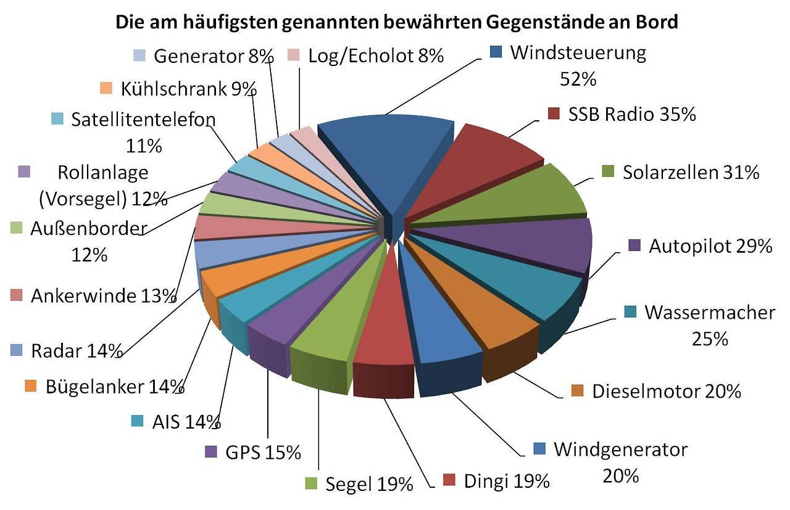
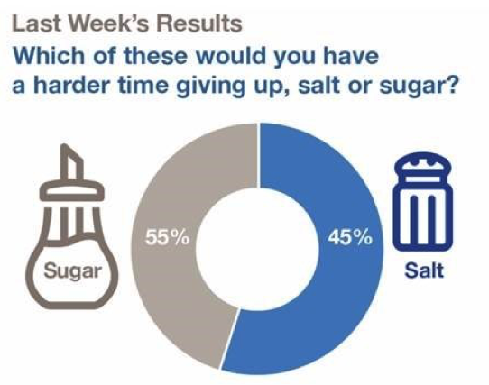

  

This is probably the most obvious pitfall example of the collection, but is probably the most frequent one as well. Number inconsistencies on a graphic just make it completely useless.

#Percentages don't add up to 100%
***
When displaying percentages on the chart, always double-check that it sums up to 100%:

  

Source: [WTF Visualizations](http://viz.wtf/post/162907112938/i-guess-its-best-to-show-all-the-data-and-use-a#notes)

  

Here, note as well that using an exploded 3D pie chart is probably the worst way to convey information ever invented. ([Read more about it](http://www.data-to-viz.com/caveat/pie.html))

#Values don't match visuals
***
In the following example, the 45% annotation is linked with the biggest part of the donut chart, which is truly misleading.

  

Source: [WTF Visualizations](http://viz.wtf/post/169392205697/fewer-people-would-have-a-hard-time-giving-up)

  

#Going further
***

- The website [WTF Visualization](http://viz.wtf) reports visualizations that make no sense on a daily basis. Check it out or follow them on [twitter](https://twitter.com/WTFViz).

#Comments
***
Any thoughts on this? Found any mistake? Disagree? Please drop me a word on [twitter](https://twitter.com/R_Graph_Gallery) or in the comment section below:
 

