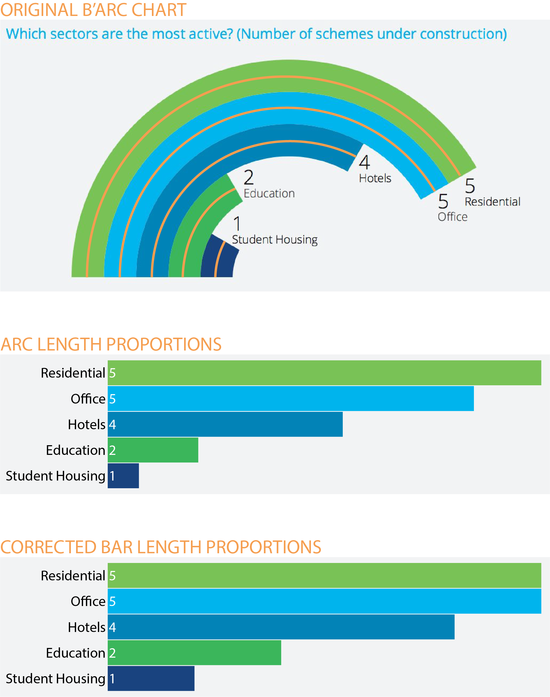

<br><br>
<div class="mycontent">

A radial bar chart is basically a [bar chart](https://www.data-to-viz.com/graph/barplot) plotted in polar coordinates instead of a Cartesian plane.
<br>
Here is one showing the quantity of weapons exported by the top 6 largest exporters in 2017. (You can read more about this story [here](http://www.data-to-viz.com/story/OneNumOneCat.html)).

```{r, fig.align='center', fig.height=6, fig.width=6, warning=FALSE, message=FALSE}
# Libraries
library(tidyverse)
library(hrbrthemes)

# Load dataset from github
data <- read.table("https://raw.githubusercontent.com/holtzy/data_to_viz/master/Example_dataset/7_OneCatOneNum.csv", header=TRUE, sep=",")

# plot
data %>%
  filter(!is.na(Value)) %>%
  arrange(Value) %>%
  tail(6) %>%
  mutate(Country=factor(Country, Country)) %>%
  ggplot( aes(x=Country, y=Value) ) +
    geom_bar(fill="#69b3a2", stat="identity") +
    geom_text(hjust = 1, size = 3, aes( y = 0, label = paste(Country," "))) +
    theme_ipsum() +
    theme(
      panel.grid.minor.y = element_blank(),
      panel.grid.major.y = element_blank(),
      legend.position="none",
      axis.text = element_blank()
    ) +
    xlab("") +
    ylab("") +
    coord_polar(theta = "y") +
    ylim(0,15000) 
```

The good thing about this kind of graphic is that it is quite eye-catching. However, because the bars are plotted on different radial points of the polar axis, they have different perimeters and cannot be compared by their lengths. A bar on the outside will be longer by construction than one on the inside, even with an equal value.
<br><br>
*note*: Other issues exist on this graphic, like the lack of a Y-axis. It is made for illustration purposes only.
<br><br>
This radial issue is very well illustrated on this post from [VisualizingData.com](http://www.visualisingdata.com/2017/09/problems-barc-charts/):

<br><br>

<center>

</center>

<center>
Source: [VisualizingData.com](http://www.visualisingdata.com/2017/09/problems-barc-charts/)
</center>
<br><br>


#Workaround
***

Radial bar charts must be avoided. Instead, you can build a usual [bar chart](https://www.data-to-viz.com/graph/barplot) or [lollipop plot](https://www.data-to-viz.com/graph/lollipop) to display the information more accurately:

```{r, fig.align='center', fig.height=8, fig.width=6, warning=FALSE, message=FALSE}
data %>%
  filter(!is.na(Value)) %>%
  arrange(Value) %>%
  mutate(Country=factor(Country, Country)) %>%
  ggplot( aes(x=Country, y=Value) ) +
    geom_segment( aes(x=Country ,xend=Country, y=0, yend=Value), color="grey") +
    geom_point(size=3, color="#69b3a2") +
    coord_flip() +
    theme_ipsum() +
    theme(
      panel.grid.minor.y = element_blank(),
      panel.grid.major.y = element_blank(),
      legend.position="none"
    ) +
    xlab("")
```

You can see more ways to represent this dataset [here](http://www.data-to-viz.com/story/OneNumOneCat.html).


#Going further
***

- *The problems with B'Arc charts* by Andy Kirk on his blog [Visualising Data](http://www.visualisingdata.com/2017/09/problems-barc-charts/)
- The [dataviz catalog](https://datavizcatalogue.com/methods/radial_bar_chart.html) has a page dedicated to radial bar charts.
- Doing a barchart with [R](https://www.r-graph-gallery.com/barplot/) and [Python](https://python-graph-gallery.com/barplot/).

#Comments
***
Any thoughts on this? Found any mistake? Disagree? Please drop me a word on [twitter](https://twitter.com/R_Graph_Gallery) or in the comment section below:
<br>


</div>


