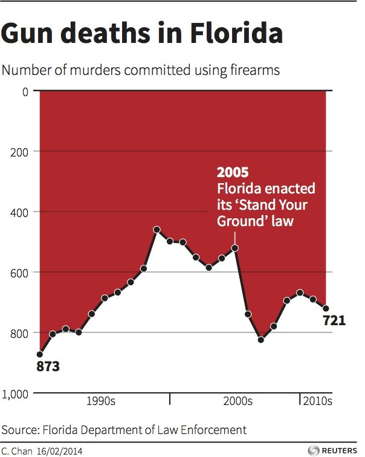
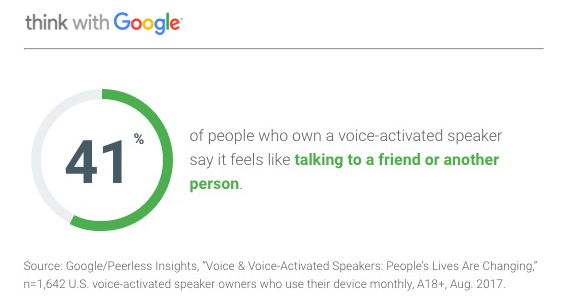

  

People are used to seeing data displayed in a usual and logical way. Not respecting the standards of data visualization can make your chart hard to understand, or even lead your audience to an incorrect conclusion.

#Reversing axis
***
The Y-axis almost always rises from the bottom to the top of the graphic. Here is an example with a reverse Y-axis. It comes from an article in [business insider](https://www.businessinsider.in/This-Chart-Shows-What-Happened-To-Gun-Deaths-In-Florida-After-Stand-Your-Ground-Was-Enacted/articleshow/30635752.cms) and describes the evolution of gun deaths in Florida.  

*Disclaimer*: I found this image on [KD Nuggets](https://www.kdnuggets.com/2016/02/common-data-visualization-mistakes.html)

  

  

Since we are not used to seeing that kind of axis, it is quite hard to understand that the number of murders committed using firearms in Florida increased between the end of the 90' and 2010. Even worse, a quick look at this graphic without paying attention to the Y-axis could lead to the wrong conclusion that the number of murders decreased in this period.

#Cheating with colors
***

Here is a marketing email from Google. It describes the behavior of 41% of the customers, but the green part of the donut chart represents 59% of the chart, which is very misleading. Source: [WTF Visualizations](http://viz.wtf/post/170949426657/new-marketing-email-from-google-email-design).

  

 

#Conclusion
***

A good graphic includes pieces of data that teach something new to the reader.  If these new pieces of information are displayed in a counter-intuitive manner, it may make the visualization more fascinating, but very well may confuse or mislead the audience. In some cases being creative is necessary for an impactful visualization, but in general it is important to respect visual display standards in order not to mislead the audience.

#Comments
***
Any thoughts on this? Found any mistake? Disagree? Please drop me a word on [twitter](https://twitter.com/R_Graph_Gallery) or in the comment section below:
 

