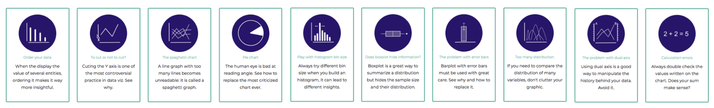

  

Cutting or not cutting the Y-axis is probably one of the most disputed topics in data visualization, as [here](http://callingbullshit.org/tools/tools_misleading_axes.html), [here](https://qz.com/418083/its-ok-not-to-start-your-y-axis-at-zero/) and [here](http://stephanieevergreen.com/y-axis/). Basically, the issue is whether or not the Y-axis should always start at zero. Let's try to find out why it is a struggle to gain consensus on this topic.

# When it is bad
***
Let's start with a barplot showing the issue:

  

Source: Fox News, via [Media Matters for America](https://www.mediamatters.org/blog/2013/04/05/fox-news-newest-dishonest-chart-immigration-enf/193507)

  

# When it is good
***

>*"In general, in a time-series, use a baseline that shows the data not the zero point"* - [Edward Tufte](https://www.edwardtufte.com/bboard/q-and-a-fetch-msg?msg_id=00003q)

# So how to choose
***
By its design, a bar graph emphasizes the absolute magnitude of values associated with each category, whereas a line graph emphasizes the change in the dependent variable (usually the y value) as the independent variable (usually the x value) changes.

- Barplot: With this kind of chart there is consensus: your Y-axis should starts at 0
- Line plot: Here however there is no consensus, even if in general you don't have to start at 0.

 
*Read more*:

- Have a look to this [#SWD challenge](http://www.storytellingwithdata.com/blog/2018/3/9/bring-on-the-bar-charts) by storytelling with data: you will see that most of the entry ordered their barplot.
- Read more about [barplot]() and [lollipop plot]()
- Have a look to the collection of dataviz pitfalls:

<!-- 

 -->

 

<a class="btn btn-primary text-uppercase js-scroll-trigger" href="https://www.data-to-viz.com/caveats.html">See the collection</a>

 

