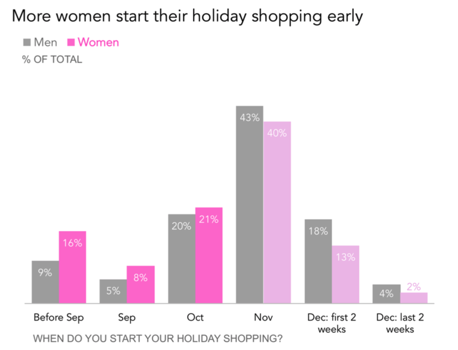
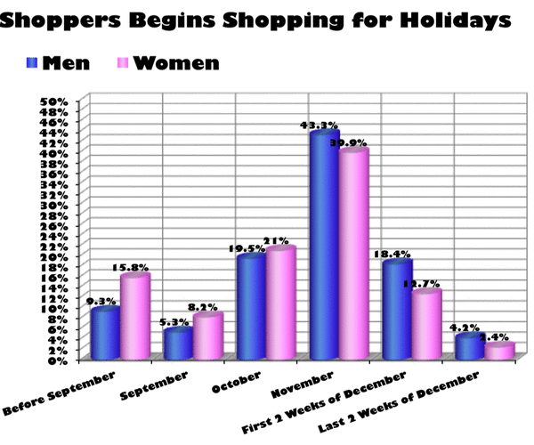

  

Getting rid of all the unnecessary elements can greatly improve the quality and impact of your chart. First, the chart will be cleaner and thus more likely to be read by people. Second, it will allow people to target directly what is important on the chart, and thus to get your point.  

Here is a good example that takes a cluttered graphic from [viz.wtf](http://viz.wtf) and gets rid of the unnecessary elements one by one. This example comes from the website [Storytelling with data](http://www.storytellingwithdata.com/blog/2017/3/29/declutter-this-graph) by [Cole Nussbaumer Knaflic](http://www.storytellingwithdata.com/about/).  

#Initial graphic
***
The idea of the chart is to show that women tend to begin Christmas shopping earlier than men:  

 

 

#Final appearance:
***

 

 

#Step by step
***

Here are the components you can consider removing when making a chart:

- 3D (always)
- Color effects for decoration (always)
- Grid lines (if unnecessary only)
- Axis
- Decimals
- Play with font and text size: some text is more important than others

Here is an animation showing the evolution of the previous chart at each step of the improvement:

  

*[The impact of decluttering your graph by Storytelling with data](http://www.storytellingwithdata.com/blog/2017/3/29/declutter-this-graph)*

 

#Going further
***

- Visit the website [Story Telling with data](http://www.storytellingwithdata.com/)
- Order [Cole's book](http://www.storytellingwithdata.com/book/): a data visualization guide for business professionals

#Comments
***
Any thoughts on this? Found any mistake? Disagree? Please drop me a word on [twitter](https://twitter.com/R_Graph_Gallery) or in the comment section below:
 

