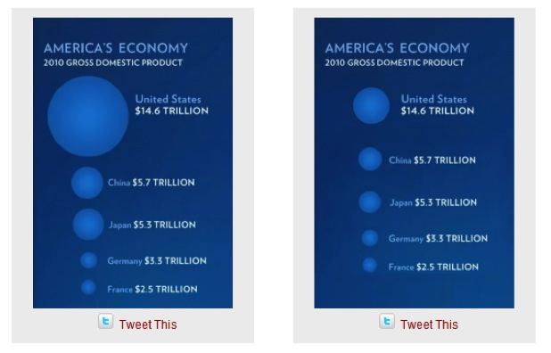

  

A usual practice in data visualization consists of `scaling` a graphic component to a numeric value. For instance, bar lengths are scaled to values in a [barplot](https://www.data-to-viz.com/graph/barplot). When the value is scaled to an area, scaling it by two sides at the same time produces a quadratic effect for a linear change. This amplifies the differences.

#Example
***
Here is an example coming from the Barack Obama’s [State of the Union](https://www.youtube.com/watch?v=kl2g40GoRxg) speech in 2011. It shows the 2010 Gross Domestic Product of 5 countries, each value being represented by a circle. The radius of each circle has been scaled based on the size of each nation’s economy. 

  

Source: [The 2011 State of the Union Address](https://www.youtube.com/watch?v=kl2g40GoRxg)

  

Here, America's economy looks way bigger than the others.

#Correction
***

This distorts the perception of the relative sizes of the circles since the radius scales linearly, but the area scales quadratically. Basically, the size of the United States economy appears much bigger than it should.

 

Here is a corrected version released on the [Fast Fedora blog](http://blog.fastfedora.com/2011/01/2011-state-of-the-union-visualizations.html) where circle size is scaled to the area instead:

  

  

The United States still has the biggest economy, but the difference from other countries does not appear as big as it did on the first graphic.

#Conclusion
***
When working with 2d objects, the scaling must be done using the area and not the radius. Furthermore, note that areas are a poor metaphor of values, being poorly perceived by human eyes. It must be used only when better visuals have already been used on the graphic (like in [bubble plot](https://www.data-to-viz.com/graph/bubble.html)). In this case, a barplot would probably have done a better job. 

#Going further
***

- *Linear vs. Quadratic Change* by [Robert Kosara](https://eagereyes.org/blog/2008/linear-vs-quadratic-change)
- *2011 State of the Union Visualizations: Charts, Graphs & Infographics* on the [Fast Fedora](http://blog.fastfedora.com/2011/01/2011-state-of-the-union-visualizations.html) blog
- This pitfall example comes from this [blog](http://paldhous.github.io/ucb/2016/dataviz/week2.html)

#Comments
***
Any thoughts on this? Found any mistake? Disagree? Please drop me a word on [twitter](https://twitter.com/R_Graph_Gallery) or in the comment section below:
 

