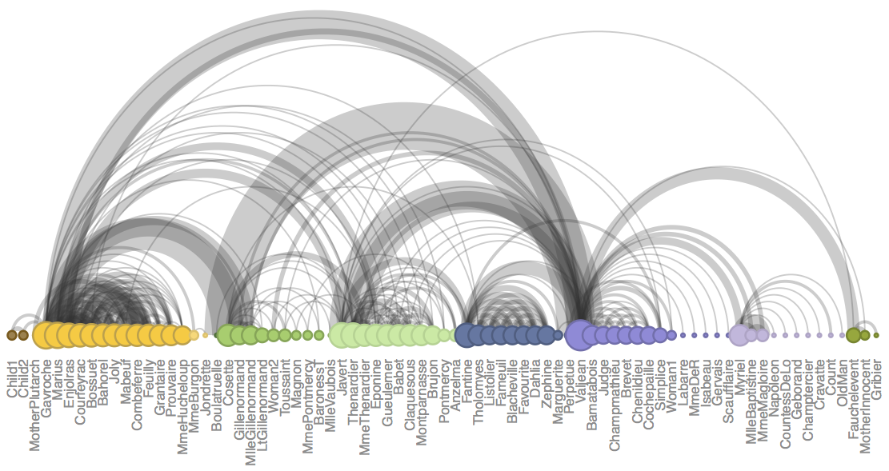

<div class="mycontent">


# Definition {#definition}
***
An `arc diagram` is a special kind of [network graph](https://www.data-to-viz.com/graph/network.html). It is consituted by `nodes` that represent entities and by `links` that show relationships between entities. In arc diagrams, nodes are displayed along a `single axis` and links are represented with arcs.              
                  

Here is a simple example. Five links between 6 nodes are represented using a [2d network diagram](https://www.data-to-viz.com/graph/network.html) (left) and an arc diagram (right)

```{r, warning=FALSE, message=FALSE, fig.align="center", fig.height=4, fig.width=10}
# Libraries
library(tidyverse)
library(viridis)
library(patchwork)
library(hrbrthemes)
library(igraph)
library(ggraph)
library(colormap)

# A really simple edge list
links=data.frame(
    source=c("A", "A", "A", "A", "B"),
    target=c("B", "C", "D", "F","E")
    )

# Transform to a igraph object
mygraph <- graph_from_data_frame(links)

# Make the usual network diagram
p1 <-  ggraph(mygraph) + 
  geom_edge_link(edge_colour="black", edge_alpha=0.3, edge_width=0.2) +
  geom_node_point( color="#69b3a2", size=5) +
  geom_node_text( aes(label=name), repel = TRUE, size=8, color="#69b3a2") +
  theme_void() +
  theme(
    legend.position="none",
    plot.margin=unit(rep(2,4), "cm")
  ) 

# Make a cord diagram
p2 <-  ggraph(mygraph, layout="linear") + 
  geom_edge_arc(edge_colour="black", edge_alpha=0.3, edge_width=0.2) +
  geom_node_point( color="#69b3a2", size=5) +
  geom_node_text( aes(label=name), repel = FALSE, size=8, color="#69b3a2", nudge_y=-0.1) +
  theme_void() +
  theme(
    legend.position="none",
    plot.margin=unit(rep(2,4), "cm")
  ) 

p1 + p2
```


# What for
***

Arc diagrams are not as good as 2d network charts to convey the overall node structure. It has 2 main advantages tough:

- it can highlight clusters and briges quite well if the node order is optimized
- it allows to display the label of each node, which is often impossible in 2d structure.

<br>

Here is an example showing the co-authorship network of a researcher. [Vincent Ranwez](https://sites.google.com/site/ranwez/) is author of several scientific [publications](https://scholar.google.fr/citations?user=WLaQnegAAAAJ&hl=en) and counts more than 100 co-authors, all represented by a node on the following chart. If two people have already been on the same paper, they are linked by an arc.


</div>

<div class = "row" style="padding-left: 50px; padding-right: 50px; margin-left: auto; margin-right: auto;">

```{r, warning=FALSE, message=FALSE, fig.align="center", fig.width=15, fig.height=7}
# Load data
dataUU <- read.table("https://raw.githubusercontent.com/holtzy/data_to_viz/master/Example_dataset/13_AdjacencyUndirectedUnweighted.csv", header=TRUE)

# Transform the adjacency matrix in a long format
connect <- dataUU %>% 
  gather(key="to", value="value", -1) %>%
  mutate(to = gsub("\\.", " ",to)) %>%
  na.omit() 

# Number of connection per person
c( as.character(connect$from), as.character(connect$to)) %>%
  as.tibble() %>%
  group_by(value) %>%
  summarize(n=n()) -> coauth
colnames(coauth) <- c("name", "n")
#dim(coauth)

# Create a graph object with igraph
mygraph <- graph_from_data_frame( connect, vertices = coauth, directed = FALSE )

# Find community
com <- walktrap.community(mygraph)
#max(com$membership)

#Reorder dataset and make the graph
coauth <- coauth %>% 
  mutate( grp = com$membership) %>%
  arrange(grp) %>%
  mutate(name=factor(name, name))

# keep only 10 first communities
coauth <- coauth %>% 
  filter(grp<16)

# keep only this people in edges
connect <- connect %>%
  filter(from %in% coauth$name) %>%
  filter(to %in% coauth$name)

# Create a graph object with igraph
mygraph <- graph_from_data_frame( connect, vertices = coauth, directed = FALSE )

# prepare a vector of n color in the viridis scale
mycolor <- colormap(colormap=colormaps$viridis, nshades=max(coauth$grp))
mycolor <- sample(mycolor, length(mycolor))

# Make the graph
ggraph(mygraph, layout="linear") + 
  geom_edge_arc(edge_colour="black", edge_alpha=0.2, edge_width=0.3, fold=TRUE) +
  geom_node_point(aes(size=n, color=as.factor(grp), fill=grp), alpha=0.5) +
  scale_size_continuous(range=c(0.5,8)) +
  scale_color_manual(values=mycolor) +
  geom_node_text(aes(label=name), angle=65, hjust=1, nudge_y = -1.1, size=2.3) +
  theme_void() +
  theme(
    legend.position="none",
    plot.margin=unit(c(0,0,0.4,0), "null"),
    panel.spacing=unit(c(0,0,3.4,0), "null")
  ) +
  expand_limits(x = c(-1.2, 1.2), y = c(-5.6, 1.2)) 

```

</div>

<div class="mycontent">

*Note*: you can read more about this story in the [dedicated page](https://www.data-to-viz.com/story/AdjacencyMatrix.html).


# Variation {#variation}
***

A possible variation in arc diagrams consists to make the links wider when the connection is stronger. To do so you need a `weighted network` where each connection as a weight.  

<br>

Since it is not the case in the previous autorship network, here is another one showing the character co-occurrence in the chapters of Victor Hugo’s classic novel Les Misérables. This example comes from [Gaston Sanchez](http://www.gastonsanchez.com/blog) and is described more in depth [here](https://www.r-bloggers.com/arc-diagrams-in-r-les-miserables/) (with R code).

```{r, warning=FALSE, message=FALSE, fig.align="center", fig.width=15, fig.height=7}
# see code at https://www.r-bloggers.com/arc-diagrams-in-r-les-miserables/
```

<br><br>
<center>

</center>

<br><br>


# Common mistakes {#mistake}
***

The order of nodes is the key for arc diagrams. See the following figure showing the same arc diagram than above, but with nodes displayed in a random order. Harder to find any insight isn't it?


</div>

<div class = "row" style="padding-left: 50px; padding-right: 50px; margin-left: auto; margin-right: auto;">

```{r, warning=FALSE, message=FALSE, fig.align="center", fig.width=15, fig.height=7}

#Reorder dataset randomly
coauth <- coauth %>% 
  slice( sample(c(1:nrow(coauth)), nrow(coauth)))

# Create a graph object with igraph
mygraph <- graph_from_data_frame( connect, vertices = coauth, directed = FALSE )

# prepare a vector of n color in the viridis scale
mycolor <- colormap(colormap=colormaps$viridis, nshades=max(coauth$grp))
mycolor <- sample(mycolor, length(mycolor))

# Make the graph
ggraph(mygraph, layout="linear") + 
  geom_edge_arc(edge_colour="black", edge_alpha=0.2, edge_width=0.3, fold=TRUE) +
  geom_node_point(aes(size=n, color=as.factor(grp), fill=grp), alpha=0.5) +
  scale_size_continuous(range=c(0.5,8)) +
  scale_color_manual(values=mycolor) +
  geom_node_text(aes(label=name), angle=65, hjust=1, nudge_y = -1.1, size=2.3) +
  theme_void() +
  theme(
    legend.position="none",
    plot.margin=unit(c(0,0,0.4,0), "null"),
    panel.spacing=unit(c(0,0,3.4,0), "null")
  ) +
  expand_limits(x = c(-1.2, 1.2), y = c(-5.6, 1.2)) 

```

</div>

<div class="mycontent">


# Related {#related}
***

<div class="row">
  <div class="col-lg-3 col-md-6 col-sm-6">
  <a href="https://www.data-to-viz.com/graph/chord.html" class="btn btn-primary mybtnrelated" style="margin-bottom:4px;white-space: normal !important;">
  
  <p class="mytitlerelated">Chord diagram</p>
  <p class="mytextrelated">A circular layout used to display weighted relationships between entities through arcs.</p>
  </a>
  </div>
  <div class="col-lg-3 col-md-6 col-sm-6">
  <a href="https://www.data-to-viz.com/graph/arc.html" class="btn btn-primary mybtnrelated" style="margin-bottom:4px;white-space: normal !important;">
  
  <p class="mytitlerelated">Arc diagram</p>
  <p class="mytextrelated">A subset of the network diagram where nodes are aligned and edges are arcs.</p>
  </a>
  </div>
  <div class="col-lg-3 col-md-6 col-sm-6">
  <a href="https://www.data-to-viz.com/graph/sankey.html" class="btn btn-primary mybtnrelated" style="margin-bottom:4px;white-space: normal !important;">
  
  <p class="mytitlerelated">Sankey diagram</p>
  <p class="mytextrelated">A flow diagram in which the width of the arrows is shown proportionally to the flow quantity.</p>
  </a>
  </div>
  <div class="col-lg-3 col-md-6 col-sm-6">
  <a href="https://www.data-to-viz.com/graph/edge_bundling.html" class="btn btn-primary mybtnrelated" style="margin-bottom:4px;white-space: normal !important;">
  
  <p class="mytitlerelated">Edge bundling</p>
  <p class="mytextrelated">Show connections between entities organized in a hierarchy.</p>
  </a>
  </div>  
</div>


# Build your own {#code}
***

The [R](https://www.r-graph-gallery.com), [Python](https://python-graph-gallery.com/arc-diagram/), [React](https://www.react-graph-gallery.com/arc-diagram) and [D3](https://d3-graph-gallery.com/arc.html) graph galleries are 4 websites providing hundreds of chart example, always providing the reproducible code. Click the button below to see how to build the chart you need with your favorite programing language.

<p>
<a href="https://www.r-graph-gallery.com/" class="btn btn-primary">R graph gallery</a>
<a href="https://python-graph-gallery.com/arc-diagram/" class="btn btn-primary">Python gallery</a>
<a href="https://www.react-graph-gallery.com/arc-diagram" class="btn btn-primary">React gallery</a>
<a href="https://d3-graph-gallery.com/arc.html" class="btn btn-primary">D3 gallery</a>
</p>


</div>


