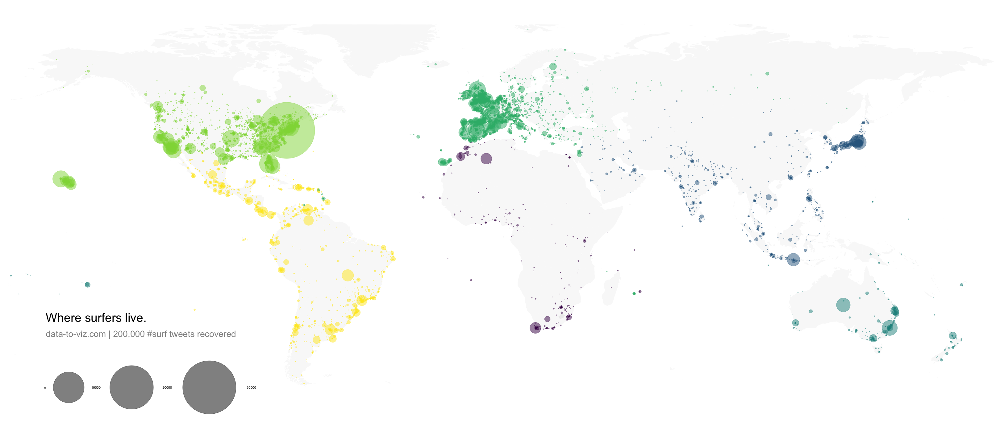

<div class="mycontent">


# Definition {#definition}
***

A `bubble map` uses circles of different size to represent a numeric value on a territory. It displays one bubble per geographic coordinate, or one bubble per region (in this case the bubble is usually displayed in the baricentre of the region).  

Here is an example showing the geographic position of about [200k tweets](https://www.data-to-viz.com/story/GPSCoordWithoutValue.html) containing the hashtags #surf, #windsurf or #kitesurf. See more about this project [here](https://www.data-to-viz.com/story/GPSCoordWithoutValue.html).


```{r, warning=FALSE, message=FALSE, fig.align="center", fig.height=6, fig.width=8, eval=FALSE}
# Libraries
library(tidyverse)
library(viridis)
library(hrbrthemes)
library(mapdata)

# Load dataset from github
data <- read.table("https://raw.githubusercontent.com/holtzy/data_to_viz/master/Example_dataset/17_ListGPSCoordinates.csv", sep=",", header=T)

# Get the world polygon
world <- map_data("world")

# Reformat data: I count the occurence of each unique position
p <- data %>%
  mutate(homelat=round(homelat,1)) %>%
  mutate(homelon=round(homelon,1)) %>%
  #head(1000) %>%
  group_by(homelat, homelon, homecontinent) %>%
  summarise(n=n()) %>%
  ggplot() +
    geom_polygon(data = world, aes(x=long, y = lat, group = group), fill="grey", alpha=0.1) +
    geom_point(aes(x=homelon, y=homelat, color=homecontinent, size=n), alpha=0.5) +
    scale_color_viridis(discrete=TRUE, guide=FALSE) +
    scale_size_continuous(range=c(0.2,68)) +
    coord_equal() +
    theme_void() +
    theme(
        panel.spacing=unit(c(0,0,0,0), "null"),
        plot.margin=grid::unit(c(0,0,0,0), "cm"),
        legend.position=c(0.15,0.07),
        legend.direction="horizontal"
    ) +
    ggplot2::annotate("text", x = -165, y = -30, hjust = 0, size = 11, label = paste("Where surfers live."), color = "Black") +
    ggplot2::annotate("text", x = -165, y = -36, hjust = 0, size = 8, label = paste("data-to-viz.com | 200,000 #surf tweets recovered"), color = "black", alpha = 0.5) +
    xlim(-180,180) +
    ylim(-60,80) +
    scale_x_continuous(expand = c(0.006, 0.006)) +
    coord_equal() 

# Save at PNG
ggsave("IMG/Surfer_bubble.png", width = 36, height = 15.22, units = "in", dpi = 90)

```


<br><br>
<center>

</center>

<br><br>


# What for
***
Bubble maps are used with two types of dataset:

- a *list of geographic coordinates* (longitude and latitude) and a numeric variable controling the size of the bubble. In the previous example, the number of tweet at each unique pair of coordinate was used.

- a *list of regions* with attributed values and knwon boundary. In this case, the bubble map will replace the usual [choropleth map](https://www.data-to-viz.com/graph/choropleth.html). Note that it allows to avoid the bias caused by different regional area in choropleth maps. (big regions tend to have more weight during the observation).


# Variation {#variation}
***

Interactivity is appreciated for bubble maps. It allows to zoom on a specific part, or click bubbles for more information. Here is an example showing a feaw earthquacke that happend in the Fiji Region since 1964 ([data](https://stat.ethz.ch/R-manual/R-devel/library/datasets/html/quakes.html))

```{r, warning=FALSE, message=FALSE, fig.align="center", fig.height=4, fig.width=9, cache=TRUE}
# Library
library(leaflet)
 
# load example data (Fiji Earthquakes) + keep only 100 first lines
data(quakes)
quakes =  head(quakes, 100)
 
# Create a color palette with handmade bins.
mybins=seq(4, 6.5, by=0.5)
mypalette = colorBin( palette="YlOrBr", domain=quakes$mag, na.color="transparent", bins=mybins)
 
# Prepare the text for the tooltip:
mytext=paste("Depth: ", quakes$depth, "<br/>", "Stations: ", quakes$stations, "<br/>", "Magnitude: ", quakes$mag, sep="") %>%
  lapply(htmltools::HTML)
 
# Final Map
leaflet(quakes) %>% 
  addTiles()  %>% 
  setView( lat=-27, lng=170 , zoom=4) %>%
  addProviderTiles("Esri.WorldImagery") %>%
  addCircles(~long, ~lat, 
    fillColor = ~mypalette(mag), fillOpacity = 0.7, color="white", radius=~sqrt(depth)*3000, stroke=FALSE, weight = 1,
    label = mytext,
    labelOptions = labelOptions( style = list("font-weight" = "normal", padding = "3px 8px"), textsize = "13px", direction = "auto")
  ) %>%
  addLegend( pal=mypalette, values=~mag, opacity=0.9, title = "Magnitude", position = "bottomright" )
```


# Common mistakes {#mistake}
***

- As for [bubble charts](https://www.data-to-viz.com/graph/bubble.html), the size of bubbles must be mapped to its area, [not to its radius](https://www.data-to-viz.com/caveat/radius_or_area.html). If not it exagerates differences. [See more](https://www.data-to-viz.com/caveat/radius_or_area.html).

- Mind [overplotting](https://www.data-to-viz.com/caveat/overplotting.html). In any case, it is a good practice to set up a bit of transparency for each bubble, allowing to see the map behind it.

- Don't forget your legend to make the link between bubble size and numeric value.


# Related {#related}
***

<div class="row">
  <div class="col-lg-3 col-md-6 col-sm-6">
  <a href="https://www.data-to-viz.com/graph/choropleth.html" class="btn btn-primary mybtnrelated" style="margin-bottom:4px;white-space: normal !important;">
  
  <p class="mytitlerelated">Choropleth</p>
  <p class="mytextrelated">Display a aggregated value for each region of the map using color gradients.</p>
  </a>
  </div>
  <div class="col-lg-3 col-md-6 col-sm-6">
  <a href="https://www.data-to-viz.com/graph/cartogram.html" class="btn btn-primary mybtnrelated" style="margin-bottom:4px;white-space: normal !important;">
  
  <p class="mytitlerelated">Cartogram</p>
  <p class="mytextrelated">A circular version of a Treemap to visualize a hierarchical organization</p>
  </a>
  </div>
  <div class="col-lg-3 col-md-6 col-sm-6">
  <a href="https://www.data-to-viz.com/graph/hexbinmap.html" class="btn btn-primary mybtnrelated" style="margin-bottom:4px;white-space: normal !important;">
  
  <p class="mytitlerelated">Hexbin map</p>
  <p class="mytextrelated">Split the geographic area in a set of hexagon and display an aggregated value for each</p>
  </a>
  </div>
  <div class="col-lg-3 col-md-6 col-sm-6">
  <a href="https://www.data-to-viz.com/graph/map.html" class="btn btn-primary mybtnrelated" style="margin-bottom:4px;white-space: normal !important;">
  
  <p class="mytitlerelated">Background Map</p>
  <p class="mytextrelated">The basis for any geographic data visualization is to build a good background map.</p>
  </a>
  </div>
</div>


# Build your own {#code}
***

The [R](https://r-graph-gallery.com/bubble-map.html), [Python](https:/python-graph-gallery.com/bubble-map/), [React](https://www.react-graph-gallery.com/bubble-map) and [D3](https://d3-graph-gallery.com/bubblemap.html) graph galleries are 4 websites providing hundreds of chart example, always providing the reproducible code. Click the button below to see how to build the chart you need with your favorite programing language.

<p>
<a href="https://r-graph-gallery.com/bubble-map.html/" class="btn btn-primary">R graph gallery</a>
<a href="https://python-graph-gallery.com/bubble-map/" class="btn btn-primary">Python gallery</a>
<a href="https://www.react-graph-gallery.com/bubble-map" class="btn btn-primary">React gallery</a>
<a href="https://d3-graph-gallery.com/bubblemap.html" class="btn btn-primary">D3 gallery</a>
</p>


</div>


