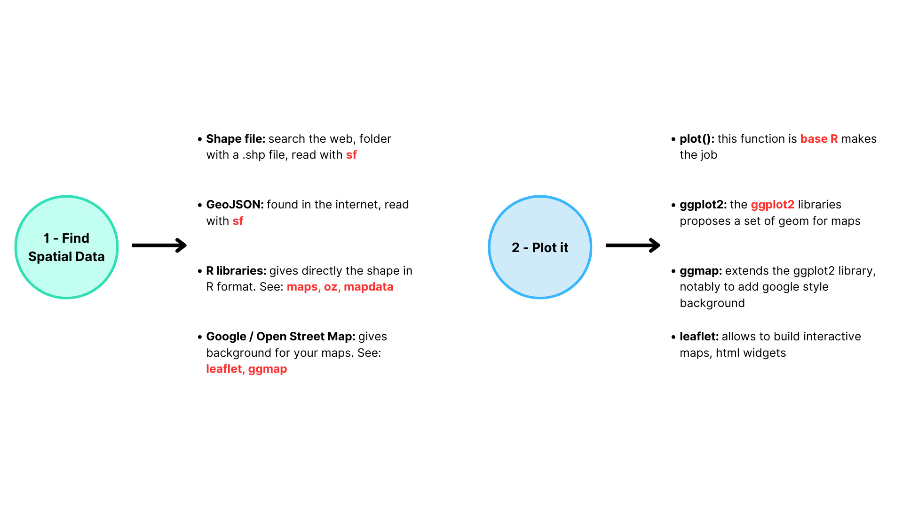

<div class="mycontent">

# Definition {#definition}
***
A `background map` is a type of visualization that uses a geographical map as the backdrop to display data points or regions. The data is overlaid on the map, allowing for a spatial understanding of the information. Background maps are often used to visualize data that is tied to a specific location, such as population density, crime rates, or weather patterns.

```{r, warning=FALSE, message=FALSE, fig.align="center", fig.height=5, fig.width=10}
library(maps)
# the map library contains many maps. Here is the world map
map('world', col="grey", fill=TRUE, bg="white", lwd=0.05, mar=rep(0,4), border=0, ylim=c(-80,80) )
```

R offers multiple avenues for generating background maps. One such method is by utilizing the `maps` package, which enables the creation of maps for the world, continents, or individual countries. However, it's worth noting that this package might not be the most suitable choice for more **intricate** or **specific** mapping objectives.

Below you can find an example of the process of working with maps in R.





# What for
***

Background maps are usually just the starting point for a visualization. They provide the foundation for displaying data in a spatial context.

Then, one will generally **transform it** into one of the following types of visualizations:

- [Choropleth maps](choropleth.html): where regions are colored according to a variable.
- [Bubble map](bubblemap.html): where bubbles are placed on the map to represent data points at specific locations.
- [Hexbin map](hexbinmap.html): where hexagons are used to represent data density.
- [Connection map](../story/MapConnection.html): where lines are used to show connections between locations.


# Build your own {#code}
***

The [R](https://www.r-graph-gallery.com/map.html), [Python](https://www.python-graph-gallery.com/map/), [React](https://www.react-graph-gallery.com/map) and [D3](https://d3-graph-gallery.com/backgroundmap.html) graph galleries are 4 websites providing hundreds of chart example, always providing the reproducible code. Click the button below to see how to build the chart you need with your favorite programing language.

<p>
<a href="https://www.r-graph-gallery.com/map.html" class="btn btn-primary">R graph gallery</a>
<a href="https://python-graph-gallery.com/map/" class="btn btn-primary">Python gallery</a>
<a href="https://www.react-graph-gallery.com/map" class="btn btn-primary">React gallery</a>
<a href="https://d3-graph-gallery.com/backgroundmap.html" class="btn btn-primary">D3 gallery</a>
</p>

</div>


