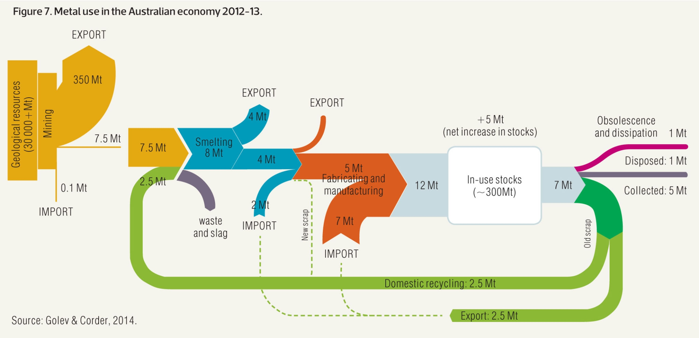

<div class="mycontent">


# Definition {#definition}
***

A `Sankey Diagram` is a visualisation technique that allows to display flows. Several entities (`nodes`) are represented by rectangles or text. Their links are represented with arrow or arcs that have a width proportional to the importance of the flow. 

Here is an example displaying the number of people migrating from one country (left) to another (right). Data used comes from this [scientific publication](https://onlinelibrary.wiley.com/doi/abs/10.1111/imre.12327).

```{r, warning=FALSE, message=FALSE, fig.align="center", fig.height=7, fig.width=10}
# Libraries
library(tidyverse)
library(viridis)
library(patchwork)
library(hrbrthemes)
library(circlize)

# Load dataset from github
data <- read.table("https://raw.githubusercontent.com/holtzy/data_to_viz/master/Example_dataset/13_AdjacencyDirectedWeighted.csv", header=TRUE)
# Package
library(networkD3)

# I need a long format
data_long <- data %>%
  rownames_to_column %>%
  gather(key = 'key', value = 'value', -rowname) %>%
  filter(value > 0)
colnames(data_long) <- c("source", "target", "value")
data_long$target <- paste(data_long$target, " ", sep="")

# From these flows we need to create a node data frame: it lists every entities involved in the flow
nodes <- data.frame(name=c(as.character(data_long$source), as.character(data_long$target)) %>% unique())
 
# With networkD3, connection must be provided using id, not using real name like in the links dataframe.. So we need to reformat it.
data_long$IDsource=match(data_long$source, nodes$name)-1 
data_long$IDtarget=match(data_long$target, nodes$name)-1

# prepare colour scale
ColourScal ='d3.scaleOrdinal() .range(["#FDE725FF","#B4DE2CFF","#6DCD59FF","#35B779FF","#1F9E89FF","#26828EFF","#31688EFF","#3E4A89FF","#482878FF","#440154FF"])'

# Make the Network
sankeyNetwork(Links = data_long, Nodes = nodes,
                     Source = "IDsource", Target = "IDtarget",
                     Value = "value", NodeID = "name", 
                     sinksRight=FALSE, colourScale=ColourScal, nodeWidth=40, fontSize=13, nodePadding=20)
```


*Note*: an *Alluvial diagram* is a sub category of Sankey diagrams where nodes are grouped in vertical nodes (sometimes called steps). In many cases, these steps represent different time stamp. Note that there are confusions on this topic as illustrated in this [twitter discussion](https://twitter.com/visualisingdata/status/580742089484439552?lang=fr). Please reach me out if you have a better definition.


# What for
***

Sankey diagrams are used to show weighted networks, i.e. flows. It can happen with several data structure:

- *evolution*: the nodes are duplicated in 2 or more groups that represent stages. Connections show the evolution between two states, like in the migration example above. This is more often visualized as a [chord diagram](https://www.data-to-viz.com/graph/chord.html).

- *source to end*: consider a total amount, the diagram shows where it comes from and where it ends up, with possible intermediate steps. Each node is unique. (Example coming from the [networkD3](https://christophergandrud.github.io/networkD3/) package).


```{r, warning=FALSE, message=FALSE, fig.align="center", fig.height=6, fig.width=9}
# Load package
library(networkD3)
 
# Load energy projection data
URL <- "https://cdn.rawgit.com/christophergandrud/networkD3/master/JSONdata/energy.json"
Energy <- jsonlite::fromJSON(URL)
 
# Now we have 2 data frames: a 'links' data frame with 3 columns (from, to, value), and a 'nodes' data frame that gives the name of each node.

# Thus we can plot it
sankeyNetwork(Links = Energy$links, Nodes = Energy$nodes, Source = "source",
              Target = "target", Value = "value", NodeID = "name",
              units = "TWh", fontSize = 12, nodeWidth = 30)
 
```


# Variation {#variation}
***

Sankey diagram are prone to many visual variations, even if the underlying idea remain the same. Here is an example showing metal recovery and recycling in Australia ([source](http://www.sankey-diagrams.com/tag/australia/)):

<br><br>
<center>

</center>

<br><br>


If you're interested to see more examples, there is a [whole website about it](http://www.sankey-diagrams.com).


# Common mistakes {#mistake}
***

- The position of nodes is very important: algorythm exist to minimize the number of crossing between links.
- Mind over-cluttering that makes the figure unreadable. It is advised to dismiss weak connections.


# Related {#related}
***

<div class="row">
  <div class="col-lg-3 col-md-6 col-sm-6">
  <a href="https://www.data-to-viz.com/graph/network.html" class="btn btn-primary mybtnrelated" style="margin-bottom:4px;white-space: normal !important;">
  
  <p class="mytitlerelated">Network</p>
  <p class="mytextrelated">Represents relationships using nodes and edges.</p>
  </a>
  </div>
  <div class="col-lg-3 col-md-6 col-sm-6">
  <a href="https://www.data-to-viz.com/graph/arc.html" class="btn btn-primary mybtnrelated" style="margin-bottom:4px;white-space: normal !important;">
  
  <p class="mytitlerelated">Arc diagram</p>
  <p class="mytextrelated">A subset of the network diagram where nodes are aligned and edges are arcs.</p>
  </a>
  </div>
  <div class="col-lg-3 col-md-6 col-sm-6">
  <a href="https://www.data-to-viz.com/graph/chord.html" class="btn btn-primary mybtnrelated" style="margin-bottom:4px;white-space: normal !important;">
  
  <p class="mytitlerelated">Chord diagram</p>
  <p class="mytextrelated">A circular layout used to display weighted relationships between entities through arcs.</p>
  </a>
  </div>
  <div class="col-lg-3 col-md-6 col-sm-6">
  <a href="https://www.data-to-viz.com/graph/edge_bundling.html" class="btn btn-primary mybtnrelated" style="margin-bottom:4px;white-space: normal !important;">
  
  <p class="mytitlerelated">Edge bundling</p>
  <p class="mytextrelated">Show connections between entities organized in a hierarchy.</p>
  </a>
  </div>  
</div>


# Build your own {#code}
***

The [R](https://www.r-graph-gallery.com) and [Python](https://www.python-graph-gallery.com) graph galleries are 2 websites providing hundreds of chart example, always providing the reproducible code. Click the button below to see how to build the chart you need with your favorite programing language.

<p>
<a href="https://www.r-graph-gallery.com/sankey-diagram/" class="btn btn-primary">R graph gallery</a>
<a href="https://python-graph-gallery.com/sankey-diagram/" class="btn btn-primary">Python gallery</a>
</p>


#Comments
***
Any thoughts on this? Found any mistake? Disagree? Please drop me a word on [twitter](https://twitter.com/R_Graph_Gallery) or in the comment section below:
<br>


</div>


