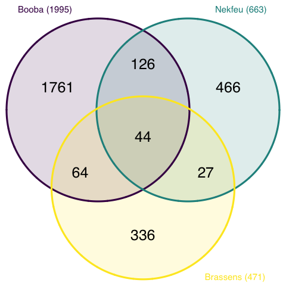
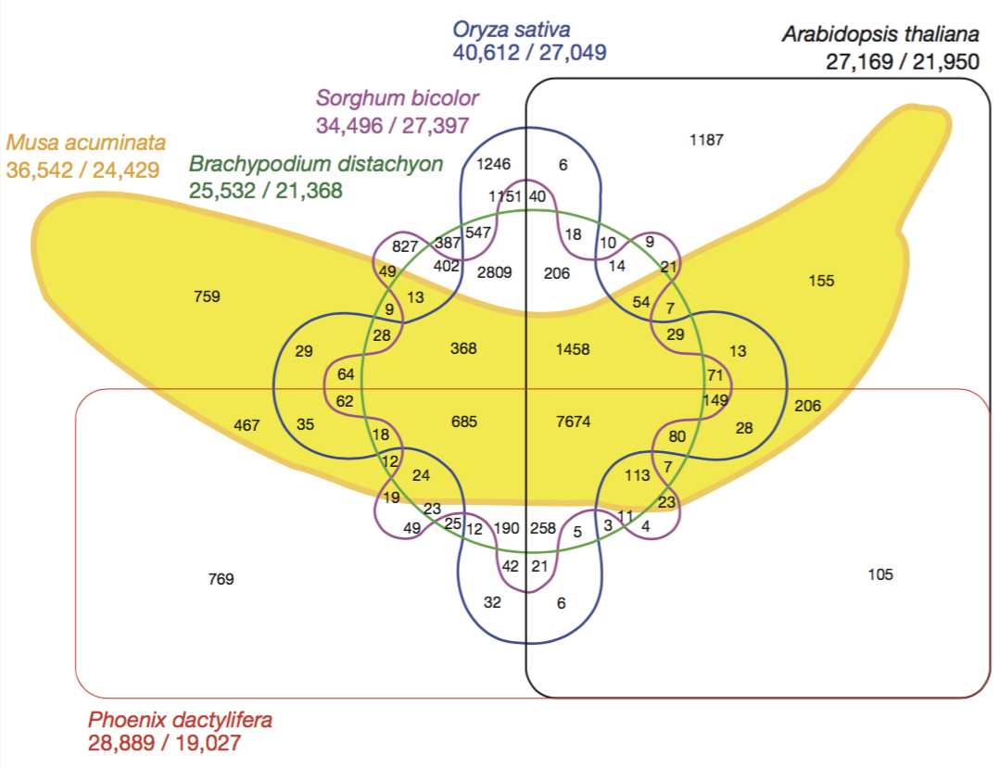

<div class="mycontent">


# Definition {#definition}
***

A `Venn diagram` (also called primary diagram, set diagram or logic diagram) is a diagram that shows all possible logical relationships between a finite collection of different sets.

Each set is represented by a circle. The circle size sometimes represents the importance of the group but not always. The groups are usually overlapping: the size of the overlap represents the intersection between both groups.

<br>

Here is an example showing the number of shared words in the lyrics of 3 famous french singers: ([Nekfeu](https://en.wikipedia.org/wiki/Nekfeu), [Booba](https://en.wikipedia.org/wiki/Booba)) and [Georges Brassens](https://en.wikipedia.org/wiki/Georges_Brassens). You can read more about this story [here](https://www.data-to-viz.com/story/SeveralIndepLists.html).

```{r, warning=FALSE, message=FALSE, fig.align="center", fig.height=6, eval=FALSE}
# Libraries
library(tidyverse)
library(hrbrthemes)
library(tm)
library(proustr)

# Load dataset from github
data <- read.table("https://raw.githubusercontent.com/holtzy/data_to_viz/master/Example_dataset/14_SeveralIndepLists.csv", header=TRUE)
to_remove <- c("_|[0-9]|\\.|function|^id|script|var|div|null|typeof|opts|if|^r$|undefined|false|loaded|true|settimeout|eval|else|artist")
data <- data %>% filter(!grepl(to_remove, word)) %>% filter(!word %in% stopwords('fr')) %>% filter(!word %in% proust_stopwords()$word)

# library
library(VennDiagram)

#cMake the plot
venn.diagram(
  x = list(
    data %>% filter(artist=="booba") %>% select(word) %>% unlist() ,
    data %>% filter(artist=="nekfeu") %>% select(word) %>% unlist() ,
    data %>% filter(artist=="georges-brassens") %>% select(word) %>% unlist()
    ),
  category.names = c("Booba (1995)" , "Nekfeu (663)" , "Brassens (471)"),
  filename = 'IMG/venn.png',
  output = TRUE ,
          imagetype="png" ,
          height = 480 ,
          width = 480 ,
          resolution = 300,
          compression = "lzw",
          lwd = 1,
          col=c("#440154ff", '#21908dff', '#fde725ff'),
          fill = c(alpha("#440154ff",0.3), alpha('#21908dff',0.3), alpha('#fde725ff',0.3)),
          cex = 0.5,
          fontfamily = "sans",
          cat.cex = 0.3,
          cat.default.pos = "outer",
          cat.pos = c(-27, 27, 135),
          cat.dist = c(0.055, 0.055, 0.085),
          cat.fontfamily = "sans",
          cat.col = c("#440154ff", '#21908dff', '#fde725ff'),
          rotation = 1
        )
```
<br><br>

<center>

</center>

<br>

Here, it is easy to understand that Booba used 1995 unique words in the dataset. 44 of them were also used by Brassens *and* Nekfeu, 126 only shared with Nekfeu only.


# What for
***
A venn diagram makes a really good work to study the intersection between 2 or 3 sets. It becomes very hard to read with more groups than that and thus must be avoided.

Here is a famous example: a six-set venn diagram published in [Nature](https://www.nature.com/articles/nature11241) that shows the relationship between the banana’s genome and the genome of five other species.

<br><br>

<center>

</center>

<br>


Even if this figure is quite attractive, it is really hard to extract any information from it. Here is a workaround.


# Variation {#variation}
***

To visualize the intersection between more than 3 sets, the best option is to use a [UpSet plot](http://caleydo.org/tools/upset/).

Here is an example provided by the [UpsetR](https://github.com/hms-dbmi/UpSetR) R library that displays the banana genome information seen before. The total size of each set is represented on the left barplot. Every possible intersection is represented by the bottom plot, and their occurence is shown on the top barplot.

```{r, fig.align="center", fig.width=10, warning=FALSE}
# Specific library
library(UpSetR)

# Dataset
input <- c(
  M.acuminata = 759,
  P.dactylifera = 769,
  A.thaliana = 1187,
  O.sativa = 1246,
  S.bicolor = 827,
  B.distachyon = 387,
  "P.dactylifera&M.acuminata" = 467,
  "O.sativa&M.acuminata" = 29,
  "A.thaliana&O.sativa" = 6,
  "S.bicolor&A.thaliana" = 9,
  "O.sativa&P.dactylifera" = 32,
  "S.bicolor&P.dactylifera" = 49,
  "S.bicolor&M.acuminata" = 49,
  "B.distachyon&O.sativa" = 547,
  "S.bicolor&O.sativa" = 1151,
  "B.distachyon&A.thaliana" = 10,
  "B.distachyon&M.acuminata" = 9,
  "B.distachyon&S.bicolor" = 402,
  "M.acuminata&A.thaliana" = 155,
  "A.thaliana&P.dactylifera" = 105,
  "B.distachyon&P.dactylifera" = 25,
  "S.bicolor&O.sativa&P.dactylifera" = 42,
  "B.distachyon&O.sativa&P.dactylifera" = 12,
  "S.bicolor&O.sativa&B.distachyon" = 2809,
  "B.distachyon&O.sativa&A.thaliana" = 18,
  "S.bicolor&O.sativa&A.thaliana" = 40,
  "S.bicolor&B.distachyon&A.thaliana" = 14,
  "O.sativa&B.distachyon&M.acuminata" = 28,
  "S.bicolor&B.distachyon&M.acuminata" = 13,
  "O.sativa&M.acuminata&P.dactylifera" = 35,
  "M.acuminata&S.bicolor&A.thaliana" = 21,
  "B.distachyon&M.acuminata&A.thaliana" = 7,
  "O.sativa&M.acuminata&A.thaliana" = 13,
  "M.acuminata&P.dactylifera&A.thaliana" = 206,
  "P.dactylifera&A.thaliana&S.bicolor" = 4,
  "O.sativa&A.thaliana&P.dactylifera" = 6,
  "S.bicolor&O.sativa&M.acuminata" = 64,
  "S.bicolor&M.acuminata&P.dactylifera" = 19,
  "B.distachyon&A.thaliana&P.dactylifera" = 3,
  "B.distachyon&M.acuminata&P.dactylifera" = 12,
  "B.distachyon&S.bicolor&P.dactylifera" = 23,
  "M.acuminata&B.distachyon&S.bicolor&A.thaliana" = 54,
  "P.dactylifera&S.bicolor&O.sativa&M.acuminata" = 62,
  "B.distachyon&O.sativa&M.acuminata&P.dactylifera" = 18,
  "S.bicolor&B.distachyon&O.sativa&A.thaliana" = 206,
  "B.distachyon&M.acuminata&O.sativa&A.thaliana" = 29,
  "O.sativa&M.acuminata&A.thaliana&S.bicolor" = 71,
  "M.acuminata&O.sativa&P.dactylifera&A.thaliana" = 28,
  "B.distachyon&M.acuminata&O.sativa&A.thaliana" = 7,
  "B.distachyon&S.bicolor&P.dactylifera&A.thaliana" = 11,
  "B.distachyon&O.sativa&P.dactylifera&A.thaliana" = 5,
  "A.thaliana&P.dactylifera&S.bicolor&O.sativa" = 21,
  "M.acuminata&S.bicolor&P.dactylifera&A.thaliana" = 23,
  "M.acuminata&B.distachyon&S.bicolor&P.dactylifera" = 24,
  "M.acuminata&O.sativa&S.bicolor&B.distachyon" = 368,
  "P.dactylifera&B.distachyon&S.bicolor&O.sativa" = 190,
  "P.dactylifera&B.distachyon&S.bicolor&O.sativa&A.thaliana" = 258,
  "P.dactylifera&M.acuminata&S.bicolor&B.distachyon&O.sativa" = 685,
  "M.acuminata&S.bicolor&B.distachyon&O.sativa&A.thaliana" = 1458,
  "S.bicolor&M.acuminata&P.dactylifera&O.sativa&A.thaliana" = 149,
  "B.distachyon&M.acuminata&P.dactylifera&O.sativa&A.thaliana" = 80,
  "M.acuminata&S.bicolor&B.distachyon&P.dactylifera&A.thaliana" = 113,
  "M.acuminata&S.bicolor&B.distachyon&P.dactylifera&O.sativa&A.thaliana" = 7674
)

# Plot
upset(fromExpression(input), nintersects = 40, nsets = 6, order.by = "freq", decreasing = T, mb.ratio = c(0.6, 0.4),
      number.angles = 0, text.scale = 1.1, point.size = 2.8, line.size = 1)
```


Here, it gets easy to understand that the vast majority of genes is shared between all plants, and which intersection are the biggest.


# Common mistakes {#mistake}
***

- Don't display more than 3 groups in a classic venn diagram. Over this limit the figure gets very hard to read and it is better to use a upset plot.
- If working with 2 groups, make the circle areas proportional to the represented values.
- Write the numbers into each areas.


# Related {#related}
***

<div class="row">
  <div class="col-lg-3 col-md-6 col-sm-6">
  <a href="http://www.data-to-viz.com/graph/barplot.html" class="btn btn-primary mybtnrelated" style="margin-bottom:4px;white-space: normal !important;">
  
  <p class="mytitlerelated">Barplot</p>
  <p class="mytextrelated">Represents the value of entities using bar of various length.</p>
  </a>
  </div>
  <div class="col-lg-3 col-md-6 col-sm-6">
  <a href="http://www.data-to-viz.com/graph/lollipop.html" class="btn btn-primary mybtnrelated" style="margin-bottom:4px;white-space: normal !important;">
  
  <p class="mytitlerelated">Lollipop plot</p>
  <p class="mytextrelated">A fancy barplot where bars are replaced with a dot and a segment. Allows even more options when it comes to stacking.</p>
  </a>
  </div>
  <div class="col-lg-3 col-md-6 col-sm-6">
  <a href="https://www.data-to-viz.com/graph/circularpacking.html" class="btn btn-primary mybtnrelated" style="margin-bottom:4px;white-space: normal !important;">
  
  <p class="mytitlerelated">Circular packing</p>
  <p class="mytextrelated">A circular version of a Treemap to visualize a hierarchical organization</p>
  </a>
  </div>
  <div class="col-lg-3 col-md-6 col-sm-6">
  <a href="http://www.data-to-viz.com/graph/dendrogram.html" class="btn btn-primary mybtnrelated" style="margin-bottom:4px;white-space: normal !important;">
  
  <p class="mytitlerelated">Dendrogram</p>
  <p class="mytextrelated">A network structure used to show a hierarchical organization.</p>
  </a>
  </div>
</div>


# Build your own {#code}
***

The [R](https://www.r-graph-gallery.com) and [Python](https://www.python-graph-gallery.com) graph galleries are 2 websites providing hundreds of chart example, always providing the reproducible code. Click the button below to see how to build the chart you need with your favorite programing language.

<p>
<a href="https://www.r-graph-gallery.com/barplot/" class="btn btn-primary">R graph gallery</a>
<a href="https://python-graph-gallery.com/barplot/" class="btn btn-primary">Python gallery</a>
</p>


#Comments
***
Any thoughts on this? Found any mistake? Disagree? Please drop me a word on [twitter](https://twitter.com/R_Graph_Gallery) or in the comment section below:
<br>


</div>


