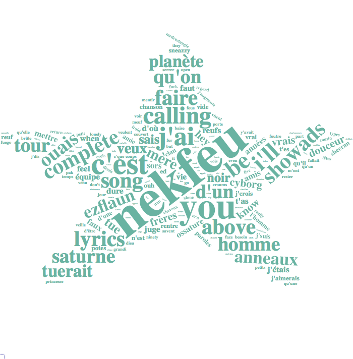

<div class="mycontent">


# Definition {#definition}
***

A `word cloud` (also called tag cloud or weighted list) is a visual representation of text data. Words are usually single words, and the importance of each is shown with font size or color.

<br>

Here is an example showing the most frequent words used by [Nekfeu](https://en.wikipedia.org/wiki/Nekfeu), a famous french raper, in a few of his songs. You can read more about this story [here](https://www.data-to-viz.com/story/SeveralIndepLists.html).

```{r, warning=FALSE, message=FALSE, fig.align="center", fig.height=8, fig.width=8}
# Libraries
library(tidyverse)
library(hrbrthemes)
library(tm)
library(proustr)

# Load dataset from github
data <- read.table("https://raw.githubusercontent.com/holtzy/data_to_viz/master/Example_dataset/14_SeveralIndepLists.csv", header=TRUE) 
to_remove <- c("_|[0-9]|\\.|function|^id|script|var|div|null|typeof|opts|if|^r$|undefined|false|loaded|true|settimeout|eval|else|artist")
data <- data %>% filter(!grepl(to_remove, word)) %>% filter(!word %in% stopwords('fr')) %>% filter(!word %in% proust_stopwords()$word)

# The wordcloud 2 library is the best option for wordcloud in R
library(wordcloud2)

# prepare a list of word (50 most frequent)
mywords <- data %>%
  filter(artist=="nekfeu") %>%
  dplyr::select(word) %>%
  group_by(word) %>%
  summarize(freq=n()) %>%
  arrange(freq) %>%
  tail(30)

# Make the plot
wordcloud2(mywords,  minRotation = -pi/2, maxRotation = -pi/2,
         backgroundColor = "white", color="#69b3a2")
```


# What for
***

Wordcloud is useful for quickly perceiving the most prominent terms and for locating a term alphabetically to determine its relative prominence. It is widely used in media and well understood by the public.

<br>

However, it is a highly criticized way to convey information due to its lack of accuracy. This is due to 2 main reasons:

- [Area is a poor metaphor](http://www.data-to-viz.com/caveat/bubble_hard.html) of a numeric value that is hardly perceived by human eye. Thus readers struggle to translate word size to an accurate frequency. ([read more](http://www.data-to-viz.com/caveat/bubble_hard.html))

- Longer words appear bigger by construction, since they are composed by more letters. It creates a bias that makes wordcloud even less accurate.

<br>

A good workaround is to use [barplot](https://wwww.data-to-viz.com/graph/barplot.html) or [lollipop](https://wwww.data-to-viz.com/graph/lollipop.html) plot instead. Here is an example using the same data as the previous chart:

```{r, warning=FALSE, message=FALSE, fig.align="center", fig.height=6}
# prepare a list of word (30 most frequent)
data %>%
  filter(artist=="nekfeu") %>%
  dplyr::select(word) %>%
  group_by(word) %>%
  summarize(freq=n()) %>%
  arrange(freq) %>%
  tail(30) %>%
  mutate(word=factor(word, word)) %>%
  ggplot( aes(x=word, y=freq) ) +
    geom_segment( aes(x=word ,xend=word, y=0, yend=freq), color="grey") +
    geom_point(size=3, color="#69b3a2") +
    coord_flip() +
    theme_ipsum() +
    theme(
      panel.grid.minor.y = element_blank(),
      panel.grid.major.y = element_blank(),
      legend.position="none"
    ) +
    xlab("")
```


 
  

# Variation {#variation}
***

Many variations exist for wordclouds. Shapes are often changed, sometimes using the shape of an object related to the topic. It is also possible to play with text orientation, font, size, colors etc.

```{r, warning=FALSE, message=FALSE, fig.align="center", fig.height=8, fig.width=8, eval=FALSE}
mywords <- data %>%
  filter(artist=="nekfeu") %>%
  dplyr::select(word) %>%
  group_by(word) %>%
  summarize(freq=n()) %>%
  arrange(desc(freq)) %>%
  head(200)

# Make the plot
library(webshot)
#webshot::install_phantomjs()
# Make the graph
my_graph=wordcloud2(mywords,  size=0.6, shape = 'star', backgroundColor = "white", color="#69b3a2")
library("htmlwidgets")
saveWidget(my_graph,"tmp.html", selfcontained = F)
# and in png
webshot("tmp.html","IMG/fig_1.png", delay =5, vwidth = 700, vheight=700)

```

<br><br>
<center>

</center>

<br><br>

# Common mistakes {#mistake}
***

- Building a wordcloud is a pitfall on its own, except if it is done for aesthetic reasons.


# Related {#related}
***

<div class="row">
  <div class="col-lg-3 col-md-6 col-sm-6">
  <a href="http://www.data-to-viz.com/graph/lollipop.html" class="btn btn-primary mybtnrelated" style="margin-bottom:4px;white-space: normal !important;">
  
  <p class="mytitlerelated">Lollipop plot</p>
  <p class="mytextrelated">A fancy barplot where bars are replaced with a dot and a segment. Try it and adopt it.</p>
  </a>
  </div>
  <div class="col-lg-3 col-md-6 col-sm-6">
  <a href="http://www.data-to-viz.com/graph/barplot.html" class="btn btn-primary mybtnrelated" style="margin-bottom:4px;white-space: normal !important;">
  
  <p class="mytitlerelated">Barplot</p>
  <p class="mytextrelated">Represents the value of entities using bar of various length.</p>
  </a>
  </div>
  <div class="col-lg-3 col-md-6 col-sm-6">
  <a href="http://www.data-to-viz.com/graph/WordCloudSmall.html" class="btn btn-primary mybtnrelated" style="margin-bottom:4px;white-space: normal !important;">
  
  <p class="mytitlerelated">Wordcloud</p>
  <p class="mytextrelated">A visual representation of text data, where word size is relative to their frequency.</p>
  </a>
  </div>
  <div class="col-lg-3 col-md-6 col-sm-6">
  <a href="http://www.data-to-viz.com/graph/venn.html" class="btn btn-primary mybtnrelated" style="margin-bottom:4px;white-space: normal !important;">
  
  <p class="mytitlerelated">Venn diagram</p>
  <p class="mytextrelated">Shows all possible logical relationships between a finite collection of different sets</p>
  </a>
  </div>
</div>


# Build your own {#code}
***

The [R](https://www.r-graph-gallery.com) and [Python](https://www.python-graph-gallery.com) graph galleries are 2 websites providing hundreds of chart example, always providing the reproducible code. Click the button below to see how to build the chart you need with your favorite programing language.

<p>
<a href="https://www.r-graph-gallery.com/wordcloud/" class="btn btn-primary">R graph gallery</a>
<a href="https://python-graph-gallery.com/wordcloud/" class="btn btn-primary">Python gallery</a>
</p>


#Comments
***
Any thoughts on this? Found any mistake? Disagree? Please drop me a word on [twitter](https://twitter.com/R_Graph_Gallery) or in the comment section below:
<br>


</div>


