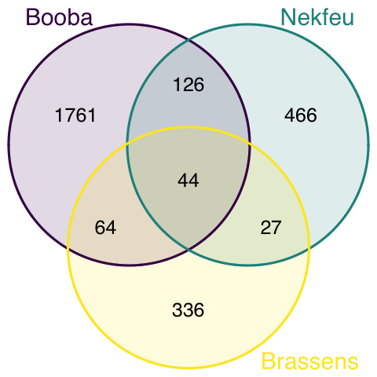

<br><br><br><br>
<div class="mycontent">


<div class = "row">
<div class = "col-md-6">
This document gives a few suggestions to analyse a dataset composed by a few lists of items.<br><br>It considers the lyrics of 2 famous french rapers ([Nekfeu](https://en.wikipedia.org/wiki/Nekfeu) and [Booba](https://en.wikipedia.org/wiki/Booba)) and a french singer ([Georges Brassens](https://en.wikipedia.org/wiki/Georges_Brassens)).<br><br>This example dataset has been downloaded from the [Paroles.net website](https://www.paroles.net/) using a custom script and is available on this [Github repository](https://github.com/holtzy/data_to_viz/tree/master/Example_dataset). Seventy five songs are considered.

```{r, warning=FALSE, message=FALSE}
# Libraries
library(tidyverse)
library(hrbrthemes)
library(kableExtra)
library(tm)
options(knitr.table.format = "html")
library(proustr)

# Load dataset from github
data <- read.table("https://raw.githubusercontent.com/holtzy/data_to_viz/master/Example_dataset/8_SeveralIndepLists.csv", header=TRUE) 
to_remove <- c("_|[0-9]|\\.|function|^id|script|var|div|null|typeof|opts|if|^r$|undefined|false|loaded|true|settimeout|eval|else|artist")
data <- data %>% filter(!grepl(to_remove, word)) %>% filter(!word %in% stopwords('fr')) %>% filter(!word %in% proust_stopwords()$word)

# show data
a <- data %>% filter(artist=="booba") %>% select(word) %>% arrange(word) %>% mutate(booba=word) %>% select(booba) %>% sample_n(6)
b <- data %>% filter(artist=="nekfeu") %>% select(word) %>% arrange(word) %>% mutate(nekfeu=word) %>% select(nekfeu) %>% sample_n(6)
c <- data %>% filter(artist=="georges-brassens") %>% select(word) %>% arrange(word) %>% mutate(brassens=word) %>% select(brassens) %>% sample_n(6)
```

</div>

<div class = "col-md-2">
```{r, echo=FALSE}
a %>% head(6) %>% kable(row.names=FALSE) %>%
  kable_styling(bootstrap_options = "striped", full_width = F)
```
</div>

<div class = "col-md-2">
```{r, echo=FALSE}
b %>% head(6) %>% kable(row.names=FALSE) %>%
  kable_styling(bootstrap_options = "striped", full_width = F)
```
</div>

<div class = "col-md-2">
```{r, echo=FALSE}
c %>% head(6) %>% kable(row.names=FALSE) %>%
  kable_styling(bootstrap_options = "striped", full_width = F)
```
</div>

</div>


#Wordcloud
***
If some words are repeated in the dataset, the first thing to do is probably to find out what are the most frequent ones. A common way to do so is to build a [wordcloud](): each word is written with a size proportionnal to its frequency. 
```{r, fig.align="center", fig.height=6}
# The wordcloud 2 library is the best option for wordcloud in R
library(wordcloud2)

# prepare a list of word (50 most frequent)
mywords <- data %>%
  filter(artist=="nekfeu") %>%
  select(word) %>%
  group_by(word) %>%
  summarize(freq=n()) %>%
  arrange(freq) %>%
  tail(50)

# Make the plot
wordcloud2(mywords, size = 2, minRotation = -pi/2, maxRotation = -pi/2,
         backgroundColor = "white", color="#69b3a2")
```

However this type of chart can be criticized since it does not reflect frequencies accurately: long words appear bigger and comparing size is always complicated. Thus, the techniques seen in [this page]() are strongly advised, and my best choice goes to the lollipop chart.

#Lollipop chart
***
A [lollipop]() chart is like a [barplot](), but the bar is replaced by a segment and a circle. It gives a lighter appearance. It is advised to use a horizontal version: words are easier to read.
```{r, fig.align="center", fig.height=6}
data %>%
  filter(artist=="nekfeu") %>%
  select(word) %>%
  group_by(word) %>%
  summarize(n=n()) %>%
  arrange(n) %>%
  mutate(word=factor(word, word)) %>%
  tail(10) %>%
  ggplot( aes(word, y=n)) +
    geom_segment( aes(x=word ,xend=word, y=0, yend=n), color="grey") +
    geom_point(size=3, color="#69b3a2") +
    coord_flip() +
    theme_ipsum() +
    ggtitle("10 most frequent words used by Nekfeu") +
    theme(
      panel.grid.minor.y = element_blank(),
      panel.grid.major.y = element_blank(),
      legend.position="none"
    ) +
    xlab("")
```


#Venn diagram
***
Once the most frequent words are known, it is of interest to know how many words are common to every lists, and how many are specific to each artist. The best way to represent this information is to use a [venn diagram]().

```{r, warning=FALSE, message=FALSE, results = "hide"}
#upload library
library(VennDiagram)
 
#Make the plot
venn.diagram(
  x = list(
    data %>% filter(artist=="booba") %>% select(word) %>% unlist() , 
    data %>% filter(artist=="nekfeu") %>% select(word) %>% unlist() , 
    data %>% filter(artist=="georges-brassens") %>% select(word) %>% unlist()
    ),
  category.names = c("Booba" , "Nekfeu" , "Brassens"),
  filename = 'venn.png',
  output = TRUE ,
          imagetype="png" ,
          height = 480 , 
          width = 480 , 
          resolution = 300,
          compression = "lzw",
          lwd = 1,
          col=c("#440154ff", '#21908dff', '#fde725ff'),
          fill = c(alpha("#440154ff",0.3), alpha('#21908dff',0.3), alpha('#fde725ff',0.3)),
          cex = 0.5,
          fontfamily = "sans",
          cat.cex = 0.6,
          cat.default.pos = "outer",
          cat.pos = c(-27, 27, 135),
          cat.dist = c(0.055, 0.055, 0.085),
          cat.fontfamily = "sans",
          cat.col = c("#440154ff", '#21908dff', '#fde725ff'),
          rotation = 1
        )
```
<center>

</center>


--> this goes further than simple data visualization. Must be kept for a blogpost instead.


#Comparing frequencies
***

Heatmap to compare the most frequent terms?
```{r}
don <- data %>%
  group_by(word, artist) %>%
  summarize(n=n()) %>%
  spread(key=artist, value=n) %>%
  rowwise() %>%
  mutate(total=sum(booba, nekfeu, `georges-brassens`)) %>%
  filter(total>5)

don %>%
  select(booba, `georges-brassens`, nekfeu) %>%
  cor()
#don 
#heatmap(don) 
```


NOTE: 

https://rcrastinate.blogspot.com
Several ides to go further.


